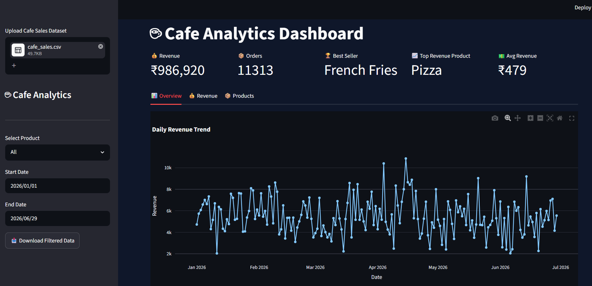
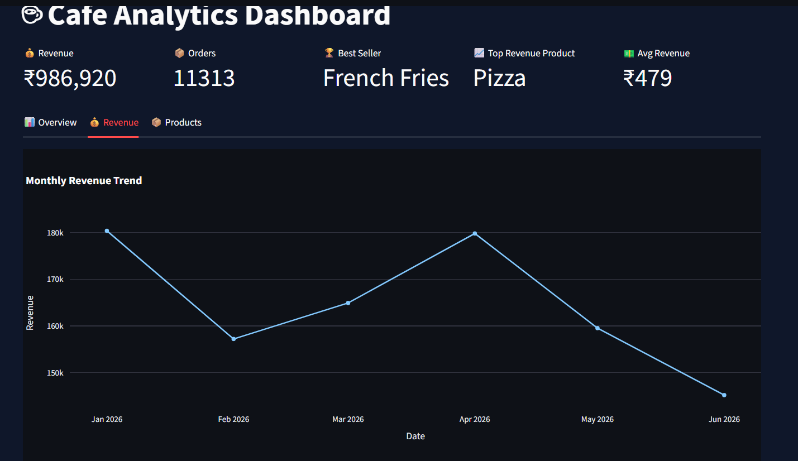
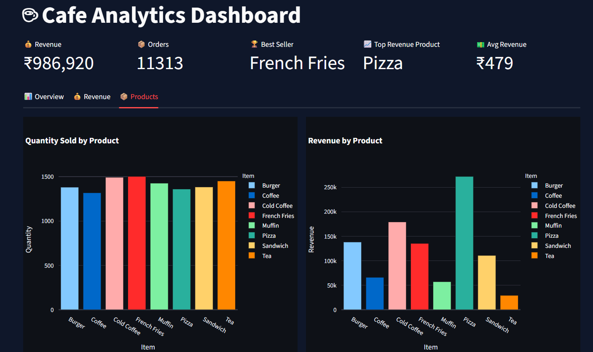
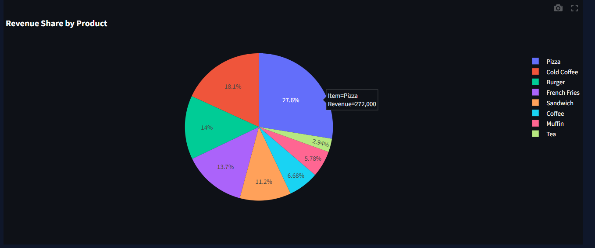

# Cafe Analytics Dashboard

An interactive analytics dashboard built using Python, Pandas, Plotly and Streamlit.

## Features

* CSV Dataset Upload
* Revenue KPIs
* Product Filter
* Date Range Filter
* Revenue Trend Analysis
* Revenue Share Visualization
* Download Filtered Data
* Interactive Dashboard

## Tech Stack

* Python
* Pandas
* Plotly
* Streamlit

## Run Locally

```bash
pip install -r requirements.txt
streamlit run dashboard.py
```

## Screenshot




